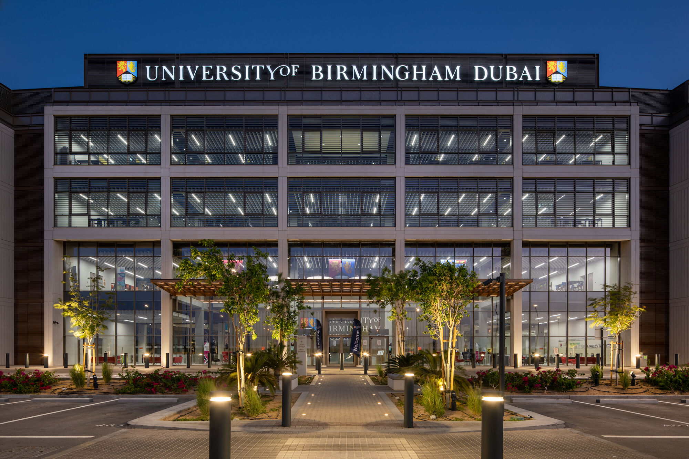

# [Artificial Intelligence and Computer Science MSc (23/24)](https://www.birmingham.ac.uk/dubai/study/courses/postgraduate/artificial-intelligence-msc.aspx) at the University of Birmingham Dubai

## Our beautiful campus at Dubai, UAE

### Core modules
- [AI Programming](https://program-and-modules-handbook.bham.ac.uk/webhandbooks/WebHandbooks-control-servlet?Action=getModuleDetailsList&pgSubj=06&pgCrse=34147&searchTerm=002023) - 20 credits
- [Artificial Intelligence and Machine Learning](https://program-and-modules-handbook.bham.ac.uk/webhandbooks/WebHandbooks-control-servlet?Action=getModuleDetailsList&pgSubj=06&pgCrse=34197&searchTerm=002023)  – 20 credits
- [Computer Systems](https://program-and-modules-handbook.bham.ac.uk/webhandbooks/WebHandbooks-control-servlet?Action=getModuleDetailsList&pgSubj=06&pgCrse=34224&searchTerm=002023) - 20 credits
- [Current Topics in Artificial Intelligence and Machine Learning](https://program-and-modules-handbook.bham.ac.uk/webhandbooks/WebHandbooks-control-servlet?Action=getModuleDetailsList&pgSubj=06&pgCrse=34149&searchTerm=002023) – 20 credits
- [Data Structures, Algorithms, and Databases](https://program-and-modules-handbook.bham.ac.uk/webhandbooks/WebHandbooks-control-servlet?Action=getModuleDetailsList&pgSubj=06&pgCrse=34141&searchTerm=0020232)  - 20 credits
- [Project - Conversion MSc](https://program-and-modules-handbook.bham.ac.uk/webhandbooks/WebHandbooks-control-servlet?Action=getModuleDetailsList&pgSubj=06&pgCrse=30383&searchTerm=002023) – 60 credits
- [Software Workshop 1](https://program-and-modules-handbook.bham.ac.uk/webhandbooks/WebHandbooks-control-servlet?Action=getModuleDetailsList&pgSubj=06&pgCrse=34182&searchTerm=002023)  – 20 credits
Please note: The modules listed on the website for this programme are regularly reviewed to ensure they are up-to-date and informed by the latest research and teaching methods